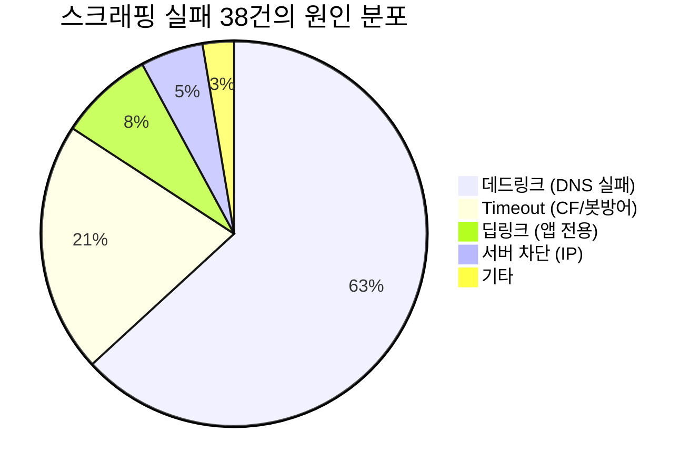

# 🔍 URL Agent 스크래핑 고도화 종합 검토 리포트

> **분석 대상**: `report-20260427_A.json` (1,215건)
> **분석 일시**: 2026-04-28
> **검토 항목**: 기존 캐시 시스템 효과 분석 → Bright Data / CapSolver 도입 실익 판단

---

## 1. 현재 시스템 캐시 아키텍처 전수 조사

현재 프로젝트에는 **5개 계층의 캐시 시스템**이 작동하고 있으며, 각각 다른 레이어에서 중복 연산과 API 비용을 절감하고 있습니다.

### 1-1. URL 영구 화이트리스트 DB (`url_whitelist.db`)

| 항목 | 값 |
|------|-----|
| 파일 | [url_whitelist_manager.py](file:///Users/jay/Projects/spam-detector/backend/app/agents/url_whitelist_manager.py) |
| 저장소 | SQLite (`url_whitelist.db`) |
| 등록 URL 수 | **2,488건** |
| 누적 히트 수 | **7,136회** |
| 만료 정책 | 1년 미사용 시 자동 삭제 |

**동작 원리**:
- URL Agent가 `is_confirmed_safe=true`로 판정한 최종 URL의 **도메인+경로** (쿼리 파라미터 제외)를 영구 저장
- 다음 배치에서 동일 URL이 들어오면 **스크래핑 + LLM 분석을 모두 건너뛰고** 즉시 HAM 반환
- 단축 URL(bit.ly 등)은 리다이렉트 후의 최종 목적지가 매번 다를 수 있으므로 **등록 차단**

**상위 빈출 도메인** (실무 효과 입증):
```
178회 - m.youtube.com/watch
137회 - m.blog.naver.com/PostView.naver
131회 - tdeal.kr/mypage/service-center
113회 - fmw.hanwhalife.com/cs/lpd/crl/...
 88회 - cica.or.kr/debt/collection_delegacy_search
```

### 1-2. URL 런타임 Vanguard 캐시 (`BATCH_URL_CACHE`)

| 항목 | 값 |
|------|-----|
| 파일 | [batch_flow.py](file:///Users/jay/Projects/spam-detector/backend/app/graphs/batch_flow.py) L31~42 |
| 저장소 | Python 딕셔너리 (메모리) |
| 유효 범위 | 현재 배치 세션 한정 (배치 종료 시 초기화) |
| 핵심 메커니즘 | **3-Strike Vanguard Leader 패턴** |

**동작 원리**:
- 동일 URL을 가진 메시지가 10건이라면, **1번 메시지(첨병/Vanguard)**만 실제 스크래핑을 수행
- 나머지 9건은 `asyncio.Condition`으로 대기하다가 첨병의 결과를 **즉시 공유** 받음
- 첨병이 실패하면 **2번째 메시지가 2번째 첨병**이 되어 재시도 (최대 3회, 3-Strike OUT 시 전원 실패 처리)
- 첨병이 성공하면 ① 런타임 캐시에 저장 + ② `is_confirmed_safe`이면 영구 DB에도 자동 등록

### 1-3. Playwright 인메모리 스크래핑 캐시 (`_url_cache`)

| 항목 | 값 |
|------|-----|
| 파일 | [tools.py](file:///Users/jay/Projects/spam-detector/backend/app/agents/url_agent/tools.py) L164, 496 |
| 저장소 | PlaywrightManager 인스턴스 딕셔너리 |
| 유효 범위 | PlaywrightManager 인스턴스 수명 (배치 세션) |

**동작 원리**:
- 동일 URL에 대한 `scrape_url()` 호출이 중복되면 **브라우저 접속 없이** 캐시된 HTML/스크린샷을 반환
- `asyncio.Lock`으로 동시 접속 시 **1건만 실행, 나머지는 대기 후 캐시 공유**

### 1-4. IBSE 시그니처 영구 DB 캐시 (`signatures.db`)

| 항목 | 값 |
|------|-----|
| 파일 | `signature_db.py` |
| 저장소 | SQLite (`signatures.db`) |
| 등록 시그니처 수 | **12,961건** |
| 매칭 방식 | 서브스트링 매칭 (메시지 내 포함 여부) |

**동작 원리**:
- 기존 KISA 데이터와 LLM이 추출한 시그니처가 영구 저장됨
- 새 메시지가 들어오면 **공백 제거 후 서브스트링 매칭** → 히트 시 **LLM 호출 완전 생략**
- LLM 비용 절감 효과가 가장 큰 캐시 (1건당 LLM 호출 1회 = ~$0.002 절감)

### 1-5. IBSE 런타임 시그니처 캐시 (`BATCH_SIGNATURE_CACHE`)

| 항목 | 값 |
|------|-----|
| 파일 | [batch_flow.py](file:///Users/jay/Projects/spam-detector/backend/app/graphs/batch_flow.py) L29 |
| 저장소 | Python Set (메모리) |
| 유효 범위 | 현재 배치 한정 |

**동작 원리**:
- LLM이 새로 추출한 시그니처 중 **KISA 규격(9~20 or 39~40 Byte)에 부합**하는 것만 Set에 등록
- 같은 배치 내 동일 패턴 스팸이 대량으로 올 때, 2번째부터는 LLM 없이 즉시 매칭

---

## 2. 실측 데이터 기반 캐시 효과 분석 (report-20260427_A)

### 2-1. URL Agent 처리 흐름 분석

```
전체 1,215건
├── URL 없는 메시지: 758건 (62.4%) → URL Agent 미호출
└── URL 포함 메시지: 457건 (37.6%)
    ├── ⚡ DB Cache 히트: 42건 (9.2%)  → 스크래핑+LLM 모두 생략
    ├── ⚡ Runtime Cache 히트: 24건 (5.3%) → 스크래핑+LLM 모두 생략
    ├── ✅ 스크래핑 성공: 353건 (77.2%) → LLM 분석 진행
    └── ❌ 스크래핑 실패: 38건 (8.3%)  → 에러 반환
```

> **캐시 절감 효과**: URL 포함 457건 중 **66건(14.4%)이 캐시로 스크래핑을 완전히 건너뜀**

### 2-2. 스크래핑 실패 38건 에러 유형 상세

| 에러 유형 | 건수 | 비율 | Bright Data로 해결 가능? | CapSolver로 해결 가능? |
|-----------|------|------|:------------------------:|:----------------------:|
| **ERR_NAME_NOT_RESOLVED** (DNS 실패) | 24 | 63.2% | ❌ 불가 | ❌ 불가 |
| **Timeout** (봇 보호/CF 차단) | 8 | 21.1% | ⚠️ 일부 가능 | ⚠️ 일부 가능 |
| **ERR_ABORTED** (앱 딥링크/차단) | 4 | 10.5% | ❌ 딥링크는 불가 | ❌ 딥링크는 불가 |
| **ERR_CONNECTION_RESET** | 1 | 2.6% | ✅ IP 우회로 해결 가능 | - |
| **ERR_HTTP2_PROTOCOL_ERROR** | 1 | 2.6% | ✅ IP 우회로 해결 가능 | - |

### 2-3. IBSE 시그니처 캐시 효과

```
스팸으로 판정된 메시지 중 시그니처 처리:
├── ⚡ DB Cache 히트 (LLM 스킵): 97건  ← 누적 학습 데이터 12,961건의 위력
├── ⚡ Runtime Cache 히트: 10건         ← 동일 배치 내 중복 패턴 방어
└── 🤖 LLM 직접 추출: 224건
```

> **시그니처 캐시 절감 효과**: 시그니처 대상 331건 중 **107건(32.3%)이 LLM 호출 없이 즉시 매칭**

---

## 3. Bright Data + CapSolver 도입 실익 판단

### 3-1. 핵심 수치: 실패 38건 중 해결 가능한 건수

```
전체 실패: 38건
├── ❌ 해결 불가능 (데드링크/DNS): 24건 (63.2%)
│   → 도메인 자체가 폐쇄됨. 어떤 프록시/솔버를 써도 접속 불가
│   → 대부분 스팸 발송자가 일회성으로 쓰고 버린 URL
│
├── ⚠️ 부분적 해결 가능: 12건 (31.6%)
│   ├── Timeout 8건: 일부는 CF 챌린지, 일부는 서버 자체 느림
│   ├── ERR_ABORTED 4건: onelink.me(앱 딥링크), saveshopping.kr
│   │   → 딥링크(3건)는 프록시/솔버로도 해결 불가 (앱 전용 URL)
│   │   → 실질적으로 해결 가능한 것은 1건 내외
│   └── ERR_CONNECTION_RESET + HTTP2 (각 1건): IP 우회로 해결 가능
│
└── ✅ 확실히 해결 가능: ~2건 (5.3%)
    → CONNECTION_RESET, HTTP2 에러 (서버가 특정 IP 대역 차단)
```

### 3-2. 비용 대비 효과 (ROI) 분석

| 항목 | 수치 |
|------|------|
| **현재 스크래핑 성공률** | 353/391 = **90.3%** |
| **도입 후 예상 성공률 (낙관)** | 365/391 = **93.4%** |
| **실질 개선 폭** | **+12건 / +3.1%p** |
| **예상 월 비용** | **$64 (≈ 8.7만원)** |
| **개선 1건당 비용** | $64 ÷ (12건 × 30일) = **$0.18/건** |

### 3-3. 기존 캐시가 이미 해결하고 있는 부분

> [!IMPORTANT]
> **캐시가 이미 해결해주고 있는 것**:
> - URL DB 화이트리스트가 매일 **42건** 이상의 스크래핑을 생략시킴 (=동일 URL 반복 유입 차단)
> - Vanguard 3-Strike 패턴이 동일 URL 10개 중 **9개의 중복 스크래핑을 차단**
> - 시그니처 DB가 **97건의 LLM 호출을 생략**시킴
>
> 이 캐시 시스템이 없었다면 매 배치마다 **+70건 이상의 추가 스크래핑**과 **+100건의 LLM 호출**이 발생했을 것입니다.

---

## 4. 종합 결론 및 권고

### 4-1. 현실적 판단



> [!WARNING]
> **전체 실패 38건 중 63.2%(24건)가 이미 폐쇄된 데드 링크(Dead Link)**이며, 이것은 Bright Data든 CapSolver든 **그 어떤 솔루션으로도 해결할 수 없습니다.**
>
> 해결 가능한 건수는 최대 **~12건(낙관적)**이며, 딥링크(앱 전용 URL) 3건을 빼면 실질적으로 **~9건** 수준입니다.

### 4-2. 도입 여부 판단 매트릭스

| 기준 | 평가 | 비고 |
|------|:----:|------|
| **비용 효율** | ⚠️ 보통 | 월 $64로 일 12건(낙관적) 개선. 1건당 $0.18 |
| **성공률 개선** | ⚠️ 미미 | 90.3% → 93.4% (최대 +3.1%p) |
| **유지보수 복잡도** | ⚠️ 증가 | 외부 서비스 2개 의존성 추가, fallback 로직 필수 |
| **운영 안정성** | ❌ 리스크 | 프록시 장애, CapSolver 잔액 소진 시 fallback 필요 |
| **기존 캐시 대비** | ❌ 열세 | 캐시 시스템이 이미 14.4%를 무비용으로 절약 중 |
| **실무 영향** | ⚠️ 낮음 | 해결되는 12건 대부분이 스팸 데드링크 인접 에러 |

### 4-3. 최종 권고

> [!TIP]
> **현 시점에서 Bright Data + CapSolver 도입은 비용 대비 효과가 크지 않습니다.**
> 
> 이미 **5단계 캐시 시스템**(URL DB 화이트리스트, Vanguard 런타임 캐시, Playwright 스크래핑 캐시, 시그니처 영구 DB, 시그니처 런타임 캐시)이 매우 효과적으로 작동하고 있으며, 실제 실패의 주 원인(63%)은 **폐쇄된 스팸 도메인**으로 외부 솔루션이 해결할 수 없는 영역입니다.

### 4-4. 대안: 비용 없이 성공률을 높이는 방법

캐시 시스템을 더 강화하는 방향이 외부 서비스 도입보다 효과적입니다.

| 대안 | 예상 효과 | 비용 |
|------|----------|------|
| ① **앱 딥링크 도메인 사전 필터** (`onelink.me` 등을 스크래핑 대상에서 제외하고 텍스트 기반 분석만 수행) | ERR_ABORTED 3~4건 해소 | $0 |
| ② **SNS Desktop 전환 확대** (기존 문서에 있는 `DESKTOP_DOMAINS` 적용) | Timeout 일부 해소 | $0 |
| ③ **URL 화이트리스트 DB 초기 시딩** (기존 배치에서 빈번하게 나오는 안전 도메인 수동 등록) | 캐시 적중률 향상 | $0 |
| ④ **Timeout 실패 시 최종 URL(리다이렉트 중간 URL) 기반 도메인 판별** | 일부 CF 실패 우회 | $0 |

---

## 부록: 캐시 시스템 데이터 플로우

```
새 메시지 수신
    │
    ├─ [Layer 1] IBSE 시그니처 DB 매칭 (12,961건) ──── 히트 → LLM 스킵
    │
    ├─ [Layer 2] IBSE 런타임 캐시 매칭 ──── 히트 → LLM 스킵
    │
    ├─ [Layer 3] URL 영구 화이트리스트 DB (2,488건)
    │   └── 히트 → 스크래핑+LLM 모두 스킵 (초고속 HAM)
    │
    ├─ [Layer 4] URL Vanguard 런타임 캐시
    │   ├── 캐시 히트 → 즉시 결과 공유
    │   ├── 리더 진행중 → 대기 후 결과 공유
    │   └── 미등록 → 첨병(Vanguard)으로 스크래핑 돌격
    │       │
    │       ├─ [Layer 5] Playwright 인메모리 캐시
    │       │   └── 동일 URL 중복 호출 시 브라우저 접속 생략
    │       │
    │       └─ 실제 스크래핑 수행
    │           ├── 성공 → 영구 DB 등록 + 런타임 캐시 등록
    │           └── 실패 → Strike 누적 (3회 시 전원 실패 처리)
    │
    └─ LLM 분석 (Text → Vision Fallback)
```
