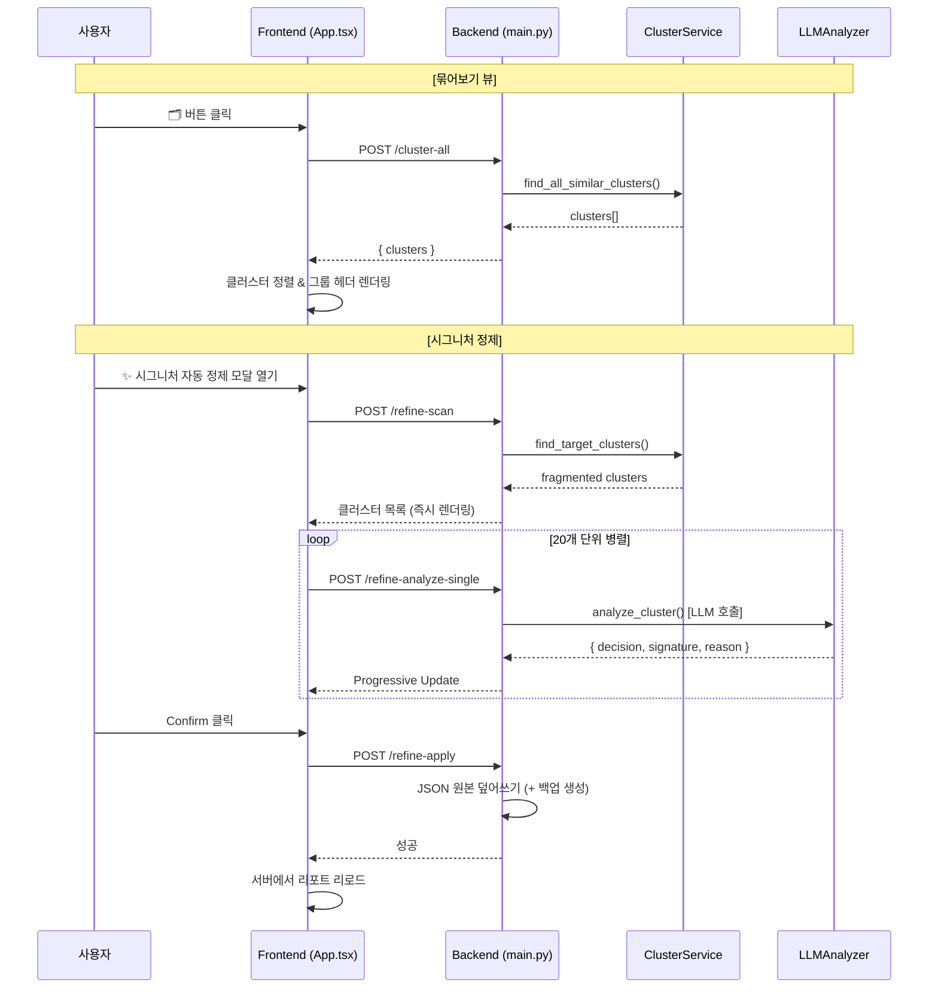

# 🔍 유사 메시지 묶어보기 기능 — 정밀 코드 분석 리서치

> 작성일: 2026-04-28  
> 대상 기능: "🗂️ 유사 메시지 묶어보기" (Cluster View Mode)

---

## 1. 기능 개요

"유사 메시지 묶어보기"는 분석 완료된 리포트(JSON) 내의 **모든 메시지를 대상으로 텍스트 유사도 85% 이상인 메시지들을 자동으로 그룹(클러스터)화**하여 UI에서 시각적으로 묶어 보여주는 기능이다.

### 핵심 목적
1. **QA(품질 검증)**: 같은 템플릿인데 SPAM/HAM 판정이 엇갈리는 불일치 케이스를 한눈에 발견
2. **시그니처 정제**: 유사 메시지 그룹 내에서 파편화된 시그니처를 LLM을 통해 하나로 통일
3. **운영 효율**: 수천 건의 메시지 중 패턴이 같은 것들을 즉시 파악

---

## 2. 시스템 아키텍처

```
┌─────────────────────────────────────────────────────────────┐
│                    Frontend (App.tsx)                        │
│  ┌─────────────────┐  ┌──────────────────────────────────┐  │
│  │ 🗂️ 묶어보기 버튼 │  │  SignatureRefinerModal.tsx        │  │
│  │ (toggleCluster  │  │  (시그니처 자동 정제 모달)          │  │
│  │  ViewMode)      │  │                                  │  │
│  └────────┬────────┘  └──────────────┬───────────────────┘  │
│           │                          │                      │
│    POST cluster-all          POST refine-scan               │
│    POST /api/reports/        POST refine-analyze-single     │
│    {filename}/cluster-all    POST refine-apply              │
└───────────┼──────────────────────────┼──────────────────────┘
            │                          │
┌───────────▼──────────────────────────▼──────────────────────┐
│                    Backend (main.py)                         │
│  ┌─────────────────────────────────────────────────────┐    │
│  │           ClusterService (cluster_svc.py)            │    │
│  │  ┌─────────────────────┐  ┌──────────────────────┐  │    │
│  │  │ find_all_similar_   │  │ find_target_         │  │    │
│  │  │ clusters()          │  │ clusters()           │  │    │
│  │  │ (묶어보기 전용)       │  │ (시그니처 정제 전용)   │  │    │
│  │  └─────────────────────┘  └──────────────────────┘  │    │
│  └─────────────────────────────────────────────────────┘    │
│  ┌─────────────────────────────────────────────────────┐    │
│  │           LLMAnalyzer (llm_analyzer.py)              │    │
│  │           (시그니처 정제 LLM 호출)                      │    │
│  └─────────────────────────────────────────────────────┘    │
│  ┌─────────────────────────────────────────────────────┐    │
│  │      ResultValidator (result_validator.py)            │    │
│  │      (클러스터 일관성 검사 — 별도 검증 모듈)              │    │
│  └─────────────────────────────────────────────────────┘    │
└─────────────────────────────────────────────────────────────┘
```

---

## 3. 핵심 파일 및 역할

| 파일 | 역할 | 위치 |
|------|------|------|
| `cluster_svc.py` | 클러스터링 핵심 알고리즘 (SequenceMatcher) | `backend/app/tools/signature_refiner/` |
| `llm_analyzer.py` | LLM 기반 시그니처 정제 분석 | `backend/app/tools/signature_refiner/` |
| `main.py` | API 엔드포인트 정의 (4개) | `backend/app/` |
| `App.tsx` | 클러스터 뷰 모드 UI (토글, 정렬, 렌더링) | `frontend/src/` |
| `SignatureRefinerModal.tsx` | 시그니처 정제 전용 모달 UI | `frontend/src/components/` |
| `result_validator.py` | 클러스터 일관성 검사 (QA 엑셀 리포트) | `backend/app/utils/` |
| `refiner_cli.py` | CLI 기반 정제 도구 (터미널 전용) | `backend/app/tools/signature_refiner/` |
| `user_interface.py` | CLI 사용자 승인 인터페이스 | `backend/app/tools/signature_refiner/` |

---

## 4. 클러스터링 알고리즘 상세 분석

### 4.1 핵심 엔진: `ClusterService` (cluster_svc.py)

두 개의 정적 메서드로 구성되며, 용도에 따라 구분된다.

#### (A) `find_all_similar_clusters()` — 묶어보기 전용

```python
# 호출 경로: App.tsx → POST /cluster-all → find_all_similar_clusters()
```

**특징:**
- **대상**: 스팸/햄 구분 없이 **전체 메시지** 대상
- **필터 없음**: ibse_signature 존재 여부와 무관하게 모든 메시지를 클러스터링
- **결과 포맷**: `{ cluster_id: number, items: [...] }` 형태로 프론트에서 렌더링 시 활용

**알고리즘 (Greedy Single-Linkage Clustering):**

```
1. 전체 메시지를 순회하며 공백 제거(normalize) 처리
2. 방문하지 않은 메시지 i를 시드(seed)로 클러스터 생성
3. i 이후의 모든 메시지 j에 대해:
   a. 길이 기반 사전 필터링 (Early Pruning)
      - max_possible_ratio = 2 * min(len1, len2) / (len1 + len2)
      - 이 값이 0.85 미만이면 SequenceMatcher 호출 생략 (성능 최적화)
   b. SequenceMatcher.ratio() >= 0.85 이면 같은 클러스터에 편입
4. 2개 이상 묶인 클러스터만 결과에 포함
5. cluster_id를 1부터 순차 부여
```

> **⚠️ 주의: Single-Linkage 한계**  
> 현재 알고리즘은 **시드(첫 번째 메시지)와의 유사도만 비교**한다.  
> 즉, 클러스터 내 메시지 A-B 유사도가 95%이고 A-C가 86%이면 C도 포함되지만,  
> B-C 유사도가 60%일 수 있다. (전이적 유사도 보장 없음)

#### (B) `find_target_clusters()` — 시그니처 정제 전용

```python
# 호출 경로: SignatureRefinerModal → POST /refine-scan → find_target_clusters()
```

**특징:**
- **대상**: `is_spam == True` **AND** `ibse_signature` 존재하는 항목만
- **추가 필터**: 클러스터 내에서 **시그니처가 2종류 이상인 그룹만** 반환
- **목적**: "파편화된 시그니처"를 통일할 대상을 정확히 선별

**차이점 요약:**

| 항목 | `find_all_similar_clusters` | `find_target_clusters` |
|------|---------------------------|----------------------|
| 대상 | 전체 (SPAM+HAM) | SPAM + ibse_signature 보유 |
| 필터 | 2개 이상 묶이면 모두 | 시그니처 2종류 이상인 그룹만 |
| 최적화 | 길이 기반 Early Pruning ✅ | Early Pruning 없음 ❌ |
| 용도 | UI 묶어보기 뷰 | 시그니처 정제 타겟 발굴 |
| 반환 포맷 | `{cluster_id, items}` | `[{log_id, message, norm_msg, current_signature}]` |

### 4.2 텍스트 정규화

```python
def normalize_text(text: str) -> str:
    return re.sub(r'\s+', '', text)
```

- 모든 공백(스페이스, 탭, 줄바꿈 등)을 제거하여 비교
- 스팸 발송자가 공백을 변형하여 우회하는 패턴에 대응

### 4.3 유사도 측정: `difflib.SequenceMatcher`

- Python 표준 라이브러리의 **Ratcliff/Obershelp** 알고리즘 사용
- `ratio()` = `2.0 * M / T` (M: 매칭 문자 수, T: 두 문자열 길이 합)
- 임계치: **0.85 (85%)**

### 4.4 시간 복잡도

- **O(N²)** 비교 (모든 쌍 비교)
- `find_all_similar_clusters`는 Early Pruning으로 SequenceMatcher 호출 수 감소
- `find_target_clusters`는 SPAM 필터로 N 자체를 줄임
- SequenceMatcher 자체: O(N × M) (N, M은 각 문자열 길이)

---

## 5. API 엔드포인트 상세

### 5.1 클러스터 뷰용 API

| 엔드포인트 | 메서드 | 용도 |
|-----------|--------|------|
| `/api/reports/{filename}/cluster-all` | POST | 전체 유사 클러스터 스캔 (묶어보기) |

**응답 구조:**
```json
{
  "success": true,
  "clusters": [
    {
      "cluster_id": 1,
      "items": [
        { "log_id": "0", "message": "...", "norm_msg": "..." },
        { "log_id": "5", "message": "...", "norm_msg": "..." }
      ]
    }
  ]
}
```

### 5.2 시그니처 정제용 API (3개)

| 엔드포인트 | 메서드 | 용도 |
|-----------|--------|------|
| `/api/reports/{filename}/refine-scan` | POST | 파편화 클러스터 발굴 (스캔) |
| `/api/reports/{filename}/refine-analyze-single` | POST | 단일 클러스터 LLM 분석 |
| `/api/reports/{filename}/refine-apply` | POST | 사용자 Confirm 후 JSON 덮어쓰기 |

---

## 6. 프론트엔드 렌더링 로직

### 6.1 클러스터 뷰 모드 (App.tsx)

**상태 관리:**
```typescript
const [clusterGroupsData, setClusterGroupsData] = useState<Array<{cluster_id, items}>>([]);
const [isClusterViewMode, setIsClusterViewMode] = useState(false);
const [isFetchingClusters, setIsFetchingClusters] = useState(false);
```

**토글 동작 (`toggleClusterViewMode`):**
1. 버튼 클릭 → `isClusterViewMode` 토글
2. 활성화 시 → `POST /cluster-all` 호출하여 클러스터 데이터 수신
3. 실패 시 → 자동으로 `isClusterViewMode = false`로 롤백

**렌더링 파이프라인 (활성화 시):**

```
filteredLogs (기존 필터 적용 후)
  ↓
① clusterMap 구축: log_id → cluster_id 매핑
  ↓
② 필터링: clusterMap에 존재하지 않는 단독 메시지 제거
  ↓
③ cluster_id 속성 주입: 각 로그 엔트리에 cluster_id 부여
  ↓
④ 통계 계산: 클러스터별 전체 건수(clusterSizeMap) / 스팸 건수(clusterSpamMap)
  ↓
⑤ 정렬: 스팸 많은 순 → 전체 크기 순 → cluster_id 순 → key 번호 순
  ↓
⑥ 렌더링: 이전 항목과 cluster_id가 다르면 그룹 헤더 삽입
```

**그룹 헤더 UI:**
```
─── 유사 메시지 그룹 #1 ── [총 5건] [스팸 4건] [햄 1건] ───
```

### 6.2 시그니처 정제 모달 (SignatureRefinerModal.tsx)

**워크플로우:**

```
① 모달 Open → fetchScan() (POST /refine-scan)
  ↓
② 클러스터 목록 즉시 렌더링 (isLoading=true)
  ↓
③ analyzeAll() 백그라운드 실행
   - 20개씩 청크 단위로 병렬 호출 (POST /refine-analyze-single)
   - 각 완료 시 해당 인덱스만 setState로 갱신 (Progressive Rendering)
  ↓
④ 사용자 리뷰
   - 체크박스 ON: 우측 통일 시그니처로 그룹 일괄 반영
   - 체크박스 OFF: 좌측 개별 시그니처 유지
   - 시그니처 직접 편집 가능 (textarea)
   - 원문 메시지 클릭 → 공백제거 텍스트를 편집창에 붙여넣기
  ↓
⑤ "최종 덮어쓰기 (Confirm)" 클릭
   - 바이트 규격 검증 (9~20 bytes 또는 39~40 bytes)
   - POST /refine-apply → JSON 원본 파일 덮어쓰기
   - 백업 파일 자동 생성 (.refiner.back)
```

**HighlightMessage 컴포넌트:**
- 시그니처 텍스트가 원문 메시지 내에서 어디에 매칭되는지 시각적으로 하이라이트
- 공백을 허용하는 유연한 정규식 매칭: 각 글자 사이에 `\s*` 삽입

---

## 7. LLM 시그니처 정제 분석 (llm_analyzer.py)

### 7.1 프롬프트 설계

**System Prompt 핵심 규칙:**
1. 기존 보유 시그니처 우선 채택 (새로 추출보다 기존 우수 후보 채택)
2. 대표 시그니처는 모든 메시지에 100% 매치되어야 함
3. 유니크함 훼손 금지 ('안녕하세요' 같은 평범한 문구 추출 불가)
4. 유니크함 손실 시 → `"decision": "unextractable"` 출력

**Human Prompt:**
- 85% 이상 유사한 메시지 그룹 전문 + 각 기존 시그니처 제공
- 응답 형식: JSON (`decision`, `signature`, `reason`)

### 7.2 LLM 키 로테이션 & 폴백

```
시도 → 429 에러 → 키 로테이션 → 재시도
  ↓
404/접근 에러 → gemini-2.5-flash로 즉시 폴백
  ↓
모든 키 소진 → { decision: "error" } 반환
```

---

## 8. 검증 모듈 연동 (result_validator.py)

ResultValidator도 **동일한 클러스터링 알고리즘을 독립적으로 수행**한다 (코드 중복).

**검사 항목:**
- 같은 클러스터 내 SPAM/HAM **판정 엇갈림** → 경고 (주황색)
- 같은 클러스터 내 **분류코드 엇갈림** → 경고
- 같은 클러스터 내 **시그니처 엇갈림** → 경고

**결과 출력:** 검증 엑셀의 "클러스터 일관성" 컬럼에 기록

---

## 9. 코드 중복 및 개선 가능 포인트

### 9.1 클러스터링 로직 3중 중복

| 위치 | 함수 | 용도 |
|------|------|------|
| `cluster_svc.py` | `find_all_similar_clusters()` | 묶어보기 UI |
| `cluster_svc.py` | `find_target_clusters()` | 시그니처 정제 |
| `result_validator.py` | `validate()` 내부 인라인 | QA 검증 |

→ 세 곳 모두 **동일한 SequenceMatcher + 0.85 임계치** 로직이 복사되어 있음.  
→ `result_validator.py`는 `ClusterService`를 import하지 않고 인라인으로 재구현.

### 9.2 성능 최적화 불균형

- `find_all_similar_clusters`에만 **Early Pruning** 최적화가 적용됨
- `find_target_clusters`와 `result_validator` 내부 로직에는 없음 (SPAM 필터로 N이 작아 문제는 적음)

### 9.3 Single-Linkage 한계

- 현재: 시드 메시지와의 유사도만 비교 → 클러스터 내 간접 관계의 유사도가 낮을 수 있음
- 잠재적 이슈: 점진적으로 변형되는 스팸 템플릿이 하나의 거대 클러스터로 병합될 가능성

---

## 10. 데이터 흐름 요약



---

## 11. 결론

"유사 메시지 묶어보기"는 **단순 UI 기능이 아니라**, 클러스터링 알고리즘 → LLM 시그니처 정제 → QA 검증까지 이어지는 **3단계 파이프라인의 시작점**이다. 핵심 알고리즘은 `difflib.SequenceMatcher` 기반의 Greedy Single-Linkage 클러스터링이며, 85% 임계치와 공백 제거 정규화를 통해 스팸 변형 패턴을 효과적으로 그룹화한다.
