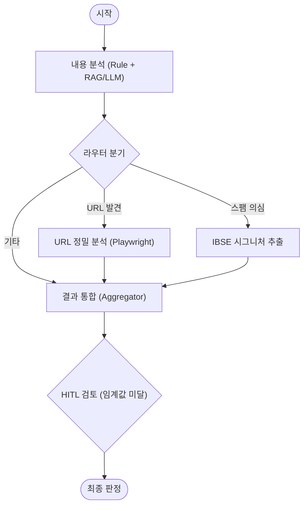

# 🛡️ Strato Spam Detector

**Strato Spam Detector**는 고정밀 스팸 문자 탐지 및 분석을 위한 AI Agent 시스템입니다. 규칙 기반 필터링(Rule-based), 다층적 내용 분석(RAG + LLM), 그리고 심층 URL 검사(Playwright)를 결합하여 지능형 스팸 공격을 식별합니다.

최근 업데이트를 통해 **안전한 취소 기능**, **정교한 RAG 참조 시스템**, **실시간 결과 수정/동기화** 기능이 강화되었습니다.

## ✨ 주요 기능 (Key Features)

### 1. 🧠 다단계 분석 파이프라인 (Multi-Stage Analysis)
*   **1단계 (Rule-Based)**: 알려진 패턴, Unicode 난독화 감지, 외국어 필터링을 통한 즉각적인 분류.
*   **2단계 (Content AI)**: LLM(RAG)을 활용하여 문맥을 이해하고 교묘한 스팸 의도를 탐지.
*   **3단계 (URL Deep Dive)**: Playwright를 사용해 URL을 실시간으로 방문하여 피싱 사이트나 리다이렉트 체인을 추적.

### 2. 📚 Spam RAG (Retrieval-Augmented Generation)
단순한 키워드 매칭을 넘어, **과거의 유사 스팸/정상 사례를 참조**하여 판단의 정확도를 높입니다.
*   **SpamValidator 에이전트**: 오탐(False Negative) 사례를 관리하고 학습합니다.
*   **중복 방지 시스템**: 동일한 메시지나 URL이 중복 등록되지 않도록 벡터 유사도 및 텍스트 매칭을 통해 방지합니다.
*   **참조 우선순위**: RAG는 판단의 **보조 근거**로 활용되며, 핵심 판단은 현재 메시지의 `harm_anchor`(악의적 의도) 분석을 따릅니다.

### 3. 🛑 안전한 취소 기능 (Robust Cancellation)
대량의 데이터를 처리하는 도중 언제든지 작업을 중단할 수 있습니다.
*   **Graceful Shutdown**: "중지" 버튼 클릭 시, 데이터 무결성을 위해 **현재 진행 중인 배치(최대 20개)** 처리를 완료한 후 안전하게 멈춥니다.
*   **즉시 피드백**: 중지 요청 시 UI에 즉시 상태가 반영되며, 취소가 완료되면 명확한 중단 메시지를 표시합니다.
*   **상태 리셋**: 새로운 파일을 업로드하면 이전 작업의 취소/진행 상태가 자동으로 초기화되어 즉시 새 작업을 시작할 수 있습니다.

### 4. ✏️ Excel/JSON 리포트 및 수정 동기화
*   **JSON 리포트**: 분석 결과는 상세 로그가 포함된 `.json` 리포트로 저장되어 언제든 다시 불러올 수 있습니다 (재분석 불필요).
*   **Excel 자동 동기화**: UI에서 오탐 결과를 수정(`HAM` ↔ `SPAM`)하면, 다운로드될 Excel 파일의 해당 행(`row_number` 매핑)이 자동으로 업데이트됩니다.
*   **Post-Processing 시트**: `URL중복 제거` 및 `문자문장차단등록` 시트가 자동으로 생성됩니다.

### 5. 🕵️ Auto-IBSE 시그니처 추출
스팸으로 분류된 메시지에서 "스팸 지문(Signature)"을 자동으로 추출하여 차단 목록 생성을 지원합니다.

---

## 🏗️ 아키텍처 (Architecture)

**LangGraph**를 사용하여 복잡한 분석 흐름을 제어합니다.



---

## 🚀 설치 및 실행 (Getting Started)

### 사전 준비사항
*   Python 3.10 이상
*   Node.js 18 이상
*   Chrome 브라우저 (Playwright 용)

### 1. 백엔드 설정 (Backend)
```bash
cd backend
python -m venv .venv
source .venv/bin/activate  # Windows: .venv\Scripts\activate
pip install -r requirements.txt
playwright install
```
`.env` 파일에 `OPENAI_API_KEY` 등을 설정합니다.

### 2. 프론트엔드 설정 (Frontend)
```bash
cd frontend
npm install
```

### 3. 실행
서버 실행 (Backend):
```bash
# backend 디렉토리에서
python run.py
# 또는
python -m uvicorn app.main:app --reload --port 8000
```

클라이언트 실행 (Frontend):
```bash
# frontend 디렉토리에서
npm run dev
```
브라우저에서 `http://localhost:5173` 접속.

---

## 📊 로깅 시스템
*   **위치**: `backend/logs/spam_detector.log`
*   **특징**: 일별 로테이션, JSON 로그 지원
*   **레벨 조정**: `/api/log-level` 엔드포인트를 통해 런타임에 로그 레벨 변경 가능.
