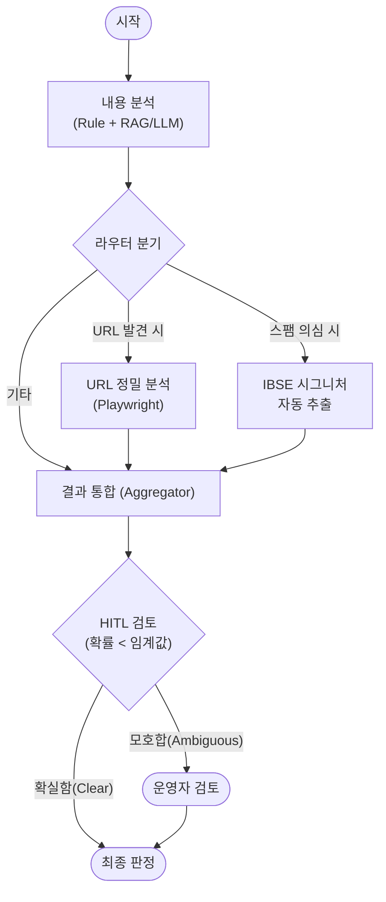
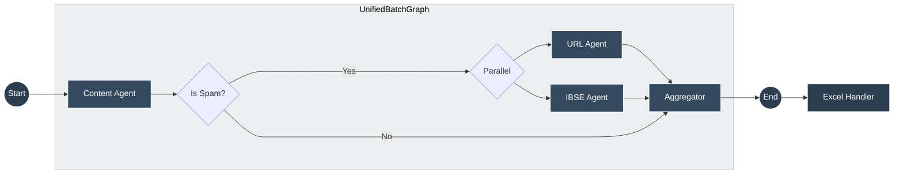

# 🛡️ Strato Spam Detector

**Strato Spam Detector**는 고정밀 스팸 문자 탐지 및 분석을 위한 AI Agent 시스템입니다. 규칙 기반 필터링(Rule-based), 다층적 내용 분석(RAG + LLM), 그리고 심층 URL 검사(Playwright)를 결합하여 지능형 스팸 공격을 식별합니다.

## ✨ 주요 기능 (Key Features)

- **🧠 다단계 분석 파이프라인 (Multi-Stage Analysis)**
  - **1단계 (Rule-Based)**: 알려진 패턴, Unicode 난독화 감지, 외국어 필터링을 통한 즉각적인 분류.
  - **2단계 (Content AI)**: LLM(RAG)을 활용하여 문맥을 이해하고 교묘한 스팸 의도를 탐지.
  - **3단계 (URL Deep Dive)**: Playwright를 사용해 URL을 실시간으로 방문하여 피싱 사이트나 리다이렉트 체인을 추적.

- **🕵️ Auto-IBSE 시그니처 추출**
  - 스팸으로 분류된 메시지에서 "스팸 지문(Signature)"을 자동으로 추출하여 차단 목록 생성을 지원합니다.

- **🤝 전문가 검토 (HITL - Human-in-the-Loop)**
  - AI의 판단이 모호한 경우(예: 확률 40~70%), 자동으로 분석을 일시 정지하고 운영자의 최종 판단을 요청합니다.

- **📚 RAG 기반 FN 학습**
  - 오탐(False Negative) 사례를 ChromaDB에 저장하여 유사 메시지 분석 시 참조합니다.
  - UI에서 쉽게 FN 예제 등록/관리 가능합니다.

- **✏️ 결과 수정 및 동기화**
  - 분석 결과를 실시간으로 수정하고 Excel 파일에 자동 반영합니다.
  - HAM ↔ SPAM 변경 시 URL중복제거/문자문장차단등록 시트도 동기화됩니다.

- **⚡ 고성능 처리 (High-Performance)**
  - **실시간 채팅**: WebSocket 스트리밍을 통해 분석 결과를 즉시 제공.
  - **대량 일괄 처리 (Batch)**: Excel(`*.xlsx`) 및 텍스트(`*.txt`) 파일의 대용량 데이터를 고속으로 분석.

## 🏗️ 아키텍처 및 파이프라인 (Architecture)

이 시스템은 **LangGraph**를 사용하여 복잡한 분석 흐름을 제어합니다.



### Rule-Based Filter (1단계 사전 필터링)

메시지가 Content Agent로 전달되기 전에 빠른 규칙 기반 필터링을 수행합니다.

| 순서 | 체크 항목 | 결과 | 설명 |
|:---:|----------|------|------|
| 1 | **Unicode 난독화** | → URL Agent | Circle letters(ⓐⓑⓒ), Fullwidth(ａｂｃ) 등 감지 시 디코딩 후 URL 분석 |
| 2 | **한글 난독화** | → Content Agent | `향.꼼.썽`, `안/내/주` 패턴 감지 시 LLM 분석 |
| 3 | **외국어 메시지** | → HAM-5 | 중국어 5자+, 일본어 5자+, 순수 영어 10자+ |
| 4 | **기타** | → Content Agent | 일반 한글 메시지는 LLM 분석 |

**Unicode 난독화 디코딩 예시:**
| 원본 | 디코딩 결과 |
|------|------------|
| `lⓔtⓩ.kr/abc` | `letz.kr/abc` |
| `ｗｗｗ．ｅｘａｍｐｌｅ．ｃｏｍ` | `www.example.com` |
| `₁₂₃` | `123` |

### 분석 로직
1.  **Content Node**: 규칙 및 LLM을 사용한 1차 내용 분석.
2.  **Router**: 분석 결과에 따라 다음 단계 결정:
    *   URL이 포함된 경우 ➡️ **URL Node** 병렬 실행.
    *   스팸으로 식별된 경우 ➡️ **IBSE Node** 병렬 실행 (시그니처 추출).
3.  **Aggregator (종합 판단 로직)**: 모든 노드의 결과를 취합하여 최종 판정:
    *   **URL 확실 SPAM** → Content HAM이어도 **최종 SPAM** (피싱 사이트 차단)
    *   **URL 확실 안전** → Content SPAM이어도 **최종 HAM** (관리비 스미싱 오탐 방지)
    *   **URL 불확실** → Content 판정 유지 (이미지 전용 등)

#### Content Agent HARD GATE 규칙 (1차 판정)

| harm_anchor | spam_probability | route_or_cta | Content 판정 | 설명 |
|:-----------:|:----------------:|:------------:|:------------:|------|
| **false** | any | any | **HAM** | 유해 의도 없음 → 무조건 HAM |
| **true** | ≥ 0.85 | any | **SPAM** | 의도 매우 명확 → route_or_cta 무시 |
| **true** | 0.60 ~ 0.84 | **true** | **SPAM** | 의도 + CTA 모두 존재 |
| **true** | 0.60 ~ 0.84 | **false** | **HAM** | 의도 있지만 CTA 없음 |
| **true** | 0.40 ~ 0.59 | **true** | **HITL** | 애매함 → 사용자 확인 (code 30) |
| **true** | 0.40 ~ 0.59 | **false** | **HAM** | 의도 불확실 + CTA 없음 |
| **true** | < 0.40 | any | **HAM** | 의도 불확실 |

> **Signal 정의**:
> - `harm_anchor`: 도박/성인/사기/피싱/불법금융 의도가 텍스트에서 확인됨
> - `route_or_cta`: 금융거래, 앱설치, 로그인 요구, 또는 연락처(전화/문자/카톡/URL) 제공
> - `spam_probability`: LLM이 판단한 스팸 확률 (0.0 ~ 1.0)

#### Aggregator Override 규칙 (Content + URL 병합)

| 케이스 | Content 판정 | URL 판정 | URL 상태 | 최종 판정 | 설명 |
| :--- | :--- | :--- | :--- | :--- | :--- |
| **Case 1** | **SPAM** | **SPAM** | 확실한 스팸 | **SPAM** | 둘 다 스팸 (가장 강력한 스팸) |
| **Case 2** | **SPAM** | **HAM** | 확실한 안전 | **HAM** | URL이 정상 사이트로 확인 (관리비 오탐 방지) |
| **Case 3** | **SPAM** | HAM | 불확실 | **SPAM** | URL 판단 불가, Content 스팸 유지 |
| **Case 4** | **HAM** | **SPAM** | 확실한 스팸 | **SPAM** | URL이 피싱으로 확인 (이미지 스팸 대응) |
| **Case 5** | **HAM** | HAM | 확실한 안전 | **HAM** | 둘 다 정상 |
| **Case 6** | **HAM** | HAM | 불확실 | **HAM** | URL 판단 불가, Content 정상 유지 |
| **Case 7** | **SPAM/HAM** | N/A | URL 없음 | **Content 유지** | URL 분석 대상 없음 |

> **URL 상태 판단 기준**: URL Agent의 reason에 `Inconclusive`, `Error`, `Insufficient` 포함 여부

4.  **HITL**: 최종 신뢰도가 설정된 임계값보다 낮으면 운영자에게 피드백을 요청.

## 🔄 논리적 흐름 (Workflow)



스팸 원본 데이터(Raw Data)를 업로드하여 결과물을 산출하는 과정은 다음과 같습니다.

### 1. 파일 업로드 (Upload)
*   사용자는 **Excel(`*.xlsx`)** 또는 **KISA 포맷 텍스트(`*.txt`)** 파일을 업로드합니다.
*   **텍스트 파일 포맷**: `[본문내용] <TAB> [URL]` 형식 지원 (자동으로 Excel 구조로 변환됨).

### 2. 배치 분석 (Batch Analysis)
*   시스템은 데이터를 지정된 배치 크기(기본 10개)로 나누어 처리합니다.
*   **병렬 처리**: 각 배치는 LangGraph 파이프라인을 통해 고속으로 분석됩니다.
*   **진행 상황 공유**: WebSocket을 통해 처리 현황이 실시간으로 사용자에게 표시됩니다.

### 3. 결과 생성 (Result Generation)
분석이 완료되면 원본 파일에 다음 정보가 포함된 컬럼이 추가됩니다:
*   **분류 코드**: 스팸 유형 코드
    *   `0`: 기타 스팸 (통신, 대리운전, 구인/부업, 스미싱 등)
    *   `1`: 유해성 스팸 (성인, 불법 의약품, 나이트클럽 등)
    *   `2`: 사기/투자 스팸 (주식 리딩, 로또, 해킹 의심 등)
    *   `3`: 불법 도박/대출 (도박, 카지노, 불법 대출 등)
    *   `HAM-1`, `HAM-2`, `HAM-3`, `HAM-4`: 정상 메시지 세부 분류
*   **스팸 확률**: 0~100% 사이의 신뢰도 점수.
*   **판단 사유**: AI가 해당 판정을 내린 구체적인 이유.

#### 엑셀 서식
*   **정렬**: 구분 컬럼 기준 SPAM 상단, HAM 하단 정렬
*   **서식**:
    | 컬럼 | 너비 | 정렬 | 기타 |
    |------|------|------|------|
    | 메시지 | 90 | 세로 중앙 | 자동줄바꿈, SPAM시 황금색 채우기 |
    | URL | 22 | - | - |
    | 구분 | - | 중앙 | - |
    | 분류 | - | 중앙 | - |
    | 메시지 길이 | 10 | - | - |
    | Probability | 10 | 중앙 | - |
    | Reason | 90 | 세로 중앙 | 자동줄바꿈 |

### 4. 추가 시트 생성 (Post-Processing)
분석 완료 후, 활용성을 높이기 위해 두 개의 시트가 자동으로 생성됩니다:
*   **`URL중복 제거` 시트**: 스팸 메시지에서 발견된 유니크한 URL 목록 (단축 URL 제외).
*   **`문자문장차단등록` 시트**: 추출된 IBSE 시그니처(스팸 지문) 목록.

### 5. 다운로드 (Download)
*   모든 처리가 끝나면 결과가 포함된 최종 **Excel 파일**을 다운로드할 수 있습니다.

## 🛠️ 기술 스택 (Tech Stack)

- **Backend**
  - **Framework**: Python, FastAPI
  - **Orchestration**: LangGraph, LangChain
  - **Browser Automation**: Playwright
  - **Network**: WebSocket for streaming
- **Frontend**
  - **Framework**: React, Vite
  - **Styling**: TailwindCSS
  - **State**: React Query

## 📋 로깅 시스템 (Logging)

### 개요
중앙 집중식 로깅 시스템으로 콘솔/파일 동시 출력, 일별 로테이션, 런타임 레벨 변경을 지원합니다.

### 로그 파일 위치
- **일반 로그**: `backend/logs/spam_detector.log` (7일 보관, 일별 로테이션)
- **JSON 로그**: `backend/logs/spam_detector.json.log` (10MB, 5개 백업)

### 환경변수 설정 (.env)
```env
LOG_LEVEL_CONSOLE=INFO    # DEBUG, INFO, WARNING, ERROR
LOG_LEVEL_FILE=DEBUG      # DEBUG, INFO, WARNING, ERROR
LOG_JSON_ENABLED=1        # 1=활성화, 0=비활성화
LOG_CONSOLE_ENABLED=1     # 1=ON, 0=OFF (운영환경에서는 0 권장)
```

### 런타임 API

| Method | Endpoint | 설명 |
|--------|----------|------|
| `GET` | `/api/log-level` | 현재 로그 레벨 조회 |
| `POST` | `/api/log-level` | 로그 레벨 변경 |
| `POST` | `/api/log-console` | 콘솔 출력 ON/OFF |

**사용 예시:**
```bash
# 레벨 조회
curl http://localhost:8000/api/log-level

# 콘솔 레벨을 DEBUG로 변경
curl -X POST http://localhost:8000/api/log-level \
  -H "Content-Type: application/json" \
  -d '{"target": "console", "level": "DEBUG"}'

# 콘솔 출력 끄기 (운영 환경)
curl -X POST http://localhost:8000/api/log-console \
  -H "Content-Type: application/json" \
  -d '{"enabled": false}'
```

### 사전 준비사항
- Python 3.10 이상
- Node.js 18 이상
- Git

### 1. 저장소 복제 (Clone)
```bash
git clone https://github.com/jay365-code/spam-detector.git
cd spam-detector
```

### 2. 백엔드 설정 (Backend)
```bash
cd backend

# 가상환경 생성 및 활성화
python -m venv .venv
source .venv/bin/activate  # Windows: .venv\Scripts\activate

# 의존성 설치
pip install -r requirements.txt
playwright install

# 환경 변수 설정
# .env.example 파일을 .env로 변경하고 API Key 설정 (OPENAI_API_KEY 등)
```

### 3. 프론트엔드 설정 (Frontend)
```bash
cd frontend

# 의존성 설치
npm install

# 개발 서버 실행
npm run dev
```

### 4. 애플리케이션 실행
백엔드 서버 실행:
```bash
# backend 디렉토리에서
python run.py
```
실행 후 브라우저에서 프론트엔드 주소로 접속하면 됩니다.

## 🔒 보안 참고사항
*   `mcp_config.json` 및 `.env` 파일(API Key 포함)은 `.gitignore`에 의해 Git 업로드가 차단되어 있습니다.
*   배포 시 각 환경에 맞는 API Key를 별도로 설정해야 합니다.
