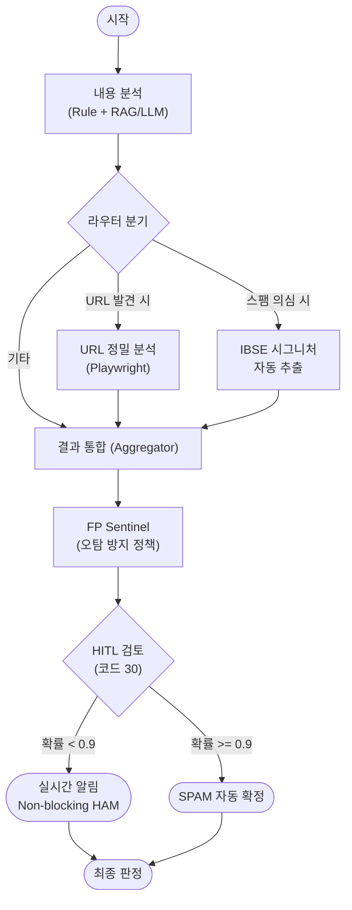
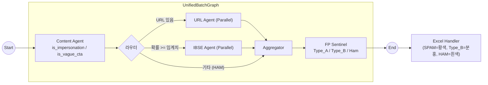

# 🛡️ Strato Spam Detector

**Strato Spam Detector**는 고정밀 스팸 문자 탐지 및 분석을 위한 AI Agent 시스템입니다. 규칙 기반 필터링(Rule-based), 다층적 내용 분석(RAG + LLM), 그리고 심층 URL 검사(Playwright)를 결합하여 지능형 스팸 공격을 식별합니다.

## ✨ 주요 기능 (Key Features)

- **🧠 다단계 분석 파이프라인 (Multi-Stage Analysis)**
  - **1단계 (Rule-Based)**: 알려진 패턴, Unicode 난독화 감지, 외국어 필터링을 통한 즉각적인 분류.
  - **2단계 (Content AI)**: LLM(RAG)을 활용하여 문맥을 이해하고, 정상 기업/업무 사칭(`is_impersonation`) 및 의도적 모호 문구(`is_vague_cta`) 등 교묘한 기만 의도를 탐지.
  - **3단계 (URL Deep Dive)**: Playwright를 사용해 URL을 실시간으로 방문하여 피싱 사이트나 리다이렉트 체인을 추적.

- **🛡️ FP Sentinel (오탐 방지 정책 에이전트)**
  - 스팸 의사결정의 마지막 단계에서 작동하여 **차단(Enforcement)과 학습(Learning) 정책을 분리**합니다.
  - 다음 룰셋으로 Type_B(FP-민감 스팸)를 식별하여, 나이브 베이즈(Naive Bayes) 학습 데이터 오염을 방지합니다:
    - **P0**: URL CONFIRMED SAFE → 무조건 Ham (c_impersonation 무시)
    - **R1**: `is_impersonation=True` + URL 있음 → Type_B
    - **R1.2**: `is_vague_cta=True` + URL SPAM 확인 → Type_B
    - **R1.5**: Content=HAM + URL 악성/timeout → Type_B
    - **R2**: 그 외 스팸 → Type_A (정상 학습)

- **📊 Spam Alignment Monitor (SAM)**
  - **트렌드 분석**: 기간별 Accuracy, Cohen's Kappa, MCC 지표를 차트로 시각화하여 품질 변화를 추적합니다.
  - **대화형 필터링**: 소스 카드(Source Tiles)를 클릭하여 특정 데이터 소스 및 FN/FP 유형별로 빠르게 필터링할 수 있습니다.
  - **품질 지표 설정**: 차트의 Y축 범위를 자유롭게 설정하여 미세한 성능 변화를 관찰할 수 있습니다.

- **📚 Spam Validator (검증 도구 고도화)**
  - **참조 시스템**: 단순 매칭이 아닌 **"의도(Intent)"** 기반의 유사 사례를 참조하여 판단의 정확도를 높입니다.
  - **데이터 관리**: 분석 결과를 가독성 높은 JSON 포맷으로 저장하고 필요 시 다시 로드할 수 있습니다.
  - **RAG 통합**: 오탐 사례를 즉시 RAG(유사 예시)에 등록하여 모델 성능 개선의 선순환 구조를 구축합니다.
  - **중복 방지**: 등록 시 중복 메시지(Exact/Semantic) 체크를 통해 데이터 클렌징을 자동화합니다.

- **🛑 안전한 취소 기능 (Robust Cancellation)**
  - **Graceful Shutdown**: 대량 처리 중 "중지" 버튼 클릭 시, 데이터 무결성을 위해 **현재 배치를 완료한 후** 안전하게 멈춥니다.
  - **즉시 피드백 & 리셋**: 중지 상태가 UI에 즉시 반영되며, 새 파일 업로드 시 모든 상태가 자동으로 초기화됩니다.

- **✏️ 결과 수정 및 동기화**
  - **Excel 자동 동기화**: UI에서 오탐 결과를 수정(`HAM` ↔ `SPAM`)하면, 다운로드될 Excel 파일의 해당 행(`row_number` 매핑)이 자동으로 업데이트됩니다.
  - **JSON 리포트**: 분석 결과와 로그가 포함된 `.json` 리포트가 생성되어 재분석 없이 결과를 로드할 수 있습니다.

- **🕵️ Auto-IBSE 시그니처 추출**
  - 스팸으로 분류된 메시지에서 "스팸 지문(Signature)"을 자동으로 추출하여 차단 목록 생성을 지원합니다.

- **🤝 전문가 검토 (HITL - Human-in-the-Loop)**
  - AI의 판단이 모호한 경우(분류 코드 30번), **배치를 멈추지 않고(Non-blocking)** 운영자에게 실시간 알림을 보냅니다.
  - 스팸 확률이 90% 이상인 경우 시스템이 스팸으로 자동 확정하며, 그 외에는 정상(HAM)으로 1차 분류하되 `[확인 필요]` 태그를 추가하여 사후 리뷰를 유도합니다.

- **⚡ 고성능 처리 (High-Performance)**
  - **실시간 채팅**: WebSocket 스트리밍을 통해 분석 결과를 즉시 제공.
  - **대량 일괄 처리 (Batch)**: Excel(`*.xlsx`) 및 텍스트(`*.txt`) 파일의 대용량 데이터를 고속으로 분석.

## 🏗️ 아키텍처 및 파이프라인 (Architecture)

이 시스템은 **LangGraph**를 사용하여 복잡한 분석 흐름을 제어합니다.



### Rule-Based Filter (1단계 사전 필터링)

메시지가 Content Agent로 전달되기 전에 빠른 규칙 기반 필터링을 수행합니다.

| 순서 | 체크 항목 | 결과 | 설명 |
|:---:|----------|------|------|
| 1 | **Unicode 난독화** | → URL Agent | Circle letters(ⓐⓑⓒ), Fullwidth(ａｂｃ) 등 감지 시 디코딩 후 URL 분석 |
| 2 | **한글 난독화** | → Content Agent | `향.꼼.썽`, `안/내/주` 패턴 감지 시 LLM 분석 |
| 3 | **외국어 메시지** | → HAM-5 | 중국어 5자+, 일본어 5자+, 순수 영어 10자+ |
| 4 | **기타** | → Content Agent | 일반 한글 메시지는 LLM 분석 |

### 분석 로직
1.  **Content Node**: 규칙 및 LLM(RAG 참조 포함)을 사용한 1차 내용 분석.
2.  **Router**: 분석 결과에 따라 다음 단계 결정:
    *   URL이 포함된 경우 ➡️ **URL Node** 병렬 실행.
    *   스팸으로 식별된 경우 ➡️ **IBSE Node** 병렬 실행 (시그니처 추출).
3.  **Aggregator (종합 판단 로직)**: 모든 노드의 결과를 취합하여 최종 판정:
    *   **URL 확실 SPAM** → Content HAM이어도 `malicious_url_extracted=True` 플래그 (텍스트 HAM 유지)
    *   **URL 확실 안전** → Content SPAM이어도 **최종 HAM** (CONFIRMED SAFE Override)
    *   **URL 불확실** → Content 판정 유지
4.  **FP Sentinel (정책 엔진)**: Aggregator 결과를 받아 Semantic Class와 Learning Label 결정:
    *   **P0** CONFIRMED SAFE → Ham 확정
    *   **R1** `is_impersonation=True` + URL 있음 → **Type_B** (차단 O, 학습 제외)
    *   **R1.2** `is_vague_cta=True` + URL SPAM → **Type_B**
    *   **R1.5** Content=HAM + URL 악성/timeout → **Type_B** (차단 O)
    *   **R2** 그 외 스팸 → **Type_A** (차단 O, 학습 O)
    *   **R3** 그 외 → **Ham**

#### Aggregator Override 규칙 (Content + URL 병합)

| 케이스 | Content | URL 판정 | 최종 (Aggregator) | FP Sentinel |
| :--- | :--- | :--- | :--- | :--- |
| **Case 1** | SPAM | SPAM | **SPAM** | Type_A or Type_B (impersonation 여부) |
| **Case 2** | SPAM | CONFIRMED SAFE | **HAM** | Ham (P0 우선) |
| **Case 3** | SPAM | 불확실/없음 | **SPAM** | Type_A or Type_B (impersonation/vague_cta 여부) |
| **Case 4** | HAM | SPAM | **HAM** + `malicious_url_extracted` | Type_B (R1.5) |
| **Case 5** | HAM | timeout/bot-block | Content 유지 → HITL 가능 | Type_B (R1.5, c_res.is_spam=False 조건) |
| **Case 6** | HAM | HAM/없음 | **HAM** | Ham |

## 🔄 논리적 흐름 (Workflow)



### 1. 파일 업로드 (Upload)
*   사용자는 **Excel(`*.xlsx`)** 또는 **KISA 포맷 텍스트(`*.txt`)** 파일을 업로드합니다.
*   **리셋 기능**: 새 파일 업로드 시 이전 작업의 취소/진행 상태가 자동으로 초기화됩니다.

### 2. 배치 분석 (Batch Analysis)
*   시스템은 데이터를 지정된 배치 크기(기본 10개)로 나누어 처리합니다.
*   **병렬 처리**: 각 배치는 LangGraph 파이프라인을 통해 고속으로 분석됩니다.
*   **안전한 취소**: 사용자 취소 요청 시, 데이터 꼬임 방지를 위해 현재 배치가 완료될 때까지 기다린 후 중단합니다.

### 3. 결과 생성 및 수정 (Result Generation & Edit)
분석 완료 후 원본 파일에 판정 결과가 추가됩니다.
*   **실시간 수정**: UI에서 개별 항목의 오탐(`HAM/SPAM`)을 수정할 수 있습니다.
*   **Excel 동기화**: 수정 사항은 `excel_row_number`를 통해 다운로드 파일에 정확히 반영됩니다.
*   **추가 시트**:
    *   **`URL중복 제거`**: 스팸 URL 유니크 목록.
    *   **`문자문장차단등록`**: IBSE 시그니처 목록.

## 📊 Spam Alignment Monitor (SAM) 상세

운영 중인 모델의 품질을 정량적으로 모니터링하고 가시화합니다.

- **Trend Chart**: Accuracy(정확도), Kappa(합의도), MCC(상관관계) 지표를 시계열로 제공.
  - 범례 클릭 시 특정 지표 On/Off 기능 제공.
  - Y축 최솟값(Min) 설정을 통한 정밀 모니터링 지원.
- **Source Breakdown**: 각 유입 경로별 에러(FN/FP) 분포를 시각화.
  - 타일 클릭 시 해당 소스/유형별 데이터 즉시 필터링.
- **Daily Summary**: 일별 주요 지표 및 데이터 일관성 확인.


## 🛠️ 기술 스택 (Tech Stack)

- **Backend**: Python, FastAPI, LangGraph, Playwright
- **Frontend**: React, Vite, TailwindCSS, React Query
- **Logging**: 일별 로테이션, JSON 로그 지원, 런타임 레벨 변경 API 제공

## 📋 로깅 시스템 (Logging)

- **로그 파일**: `backend/logs/spam_detector.log` (일반), `backend/logs/spam_detector.json.log` (JSON)
- **런타임 제어**: `/api/log-level` 엔드포인트를 통해 중단 없이 로그 레벨을 변경할 수 있습니다.

### 환경변수 설정 (.env)
```env
LOG_LEVEL_CONSOLE=INFO
LOG_LEVEL_FILE=DEBUG
LOG_JSON_ENABLED=1
```

## 🚀 시작하기

### 1. 백엔드
```bash
cd backend
python -m venv .venv
source .venv/bin/activate
pip install -r requirements.txt
playwright install
python run.py
```

### 2. 프론트엔드
```bash
cd frontend
npm install
npm run dev
```
