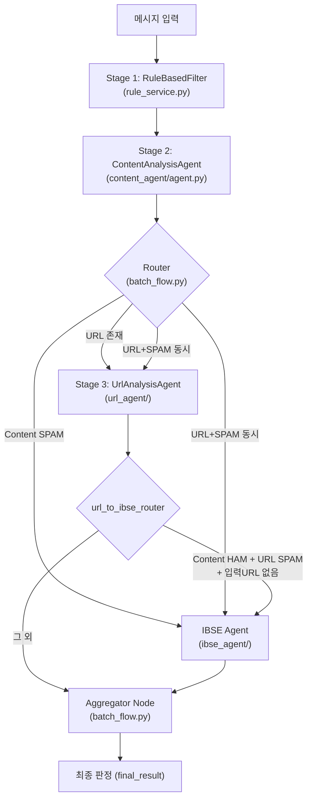
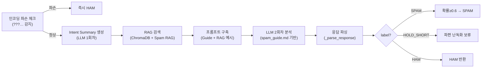
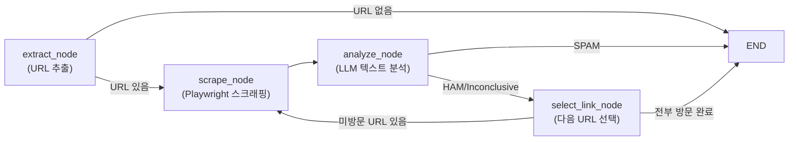
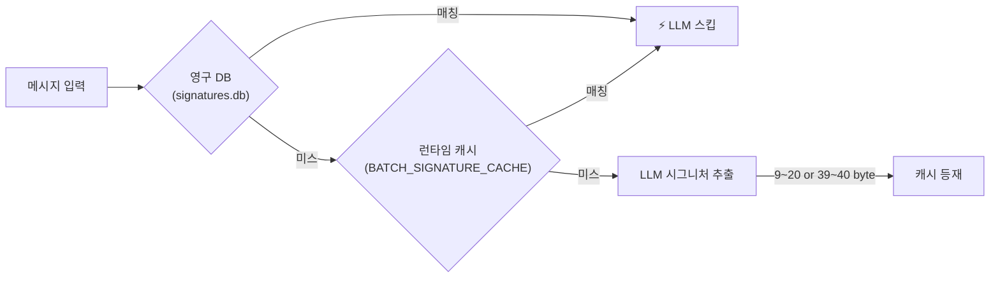

# Spam Detector 코드 분석 보고서

> Content 및 URL 기반 스팸 판별 로직의 전체 아키텍처와 상세 동작 원리를 분석합니다.

---

## 1. 전체 아키텍처 개요



### 핵심 파일 구조

| 컴포넌트 | 파일 | 역할 |
|---------|------|------|
| **메인 파이프라인** | [batch_flow.py](file:///Users/jay/Projects/spam-detector/backend/app/graphs/batch_flow.py) | LangGraph 기반 DAG 오케스트레이션 |
| **규칙 필터** | [rule_service.py](file:///Users/jay/Projects/spam-detector/backend/app/services/rule_service.py) | Stage 1 전처리 (난독화, 길이 등) |
| **Content Agent** | [content_agent/agent.py](file:///Users/jay/Projects/spam-detector/backend/app/agents/content_agent/agent.py) | Stage 2 LLM 텍스트 의도 분석 |
| **URL Agent** | [url_agent/](file:///Users/jay/Projects/spam-detector/backend/app/agents/url_agent/) | Stage 3 URL 스크래핑+LLM 분석 |
| **IBSE Agent** | [ibse_agent/](file:///Users/jay/Projects/spam-detector/backend/app/agents/ibse_agent/) | KISA 시그니처 추출 |
| **URL 화이트리스트** | [url_whitelist_manager.py](file:///Users/jay/Projects/spam-detector/backend/app/agents/url_whitelist_manager.py) | 안전 URL 영구 DB 캐시 |
| **HOLD 매니저** | [history_manager.py](file:///Users/jay/Projects/spam-detector/backend/app/agents/history_manager.py) | 난독화 파편 문자 빈도 누적 |

---

## 2. Stage 1: 규칙 기반 필터 (RuleBasedFilter)

> 파일: [rule_service.py](file:///Users/jay/Projects/spam-detector/backend/app/services/rule_service.py)

LLM 호출 전 **저비용 사전 필터링**을 수행합니다.

### 2.1 처리 순서

```
0. 최소 길이 체크 (CP949 기준, 기본 9바이트 미만 → SKIP)
1. Unicode 난독화 체크 (ⓐⓑⓒ, ａｂｃ 등 → 디코딩 후 LLM 전달)
2. 한글 난독화 패턴 (향.꼼.썽 등 → LLM 전달)
3. 알파벳-숫자 혼용 난독화 비율 (임계치 초과 → 즉시 SPAM)
4. 통과 → Stage 2로 전달
```

### 2.2 주요 산출물

| 필드 | 설명 |
|------|------|
| `is_spam` | `True`(즉시 스팸), `None`(LLM 분석 필요), `False`(SKIP) |
| `decoded_text` | Unicode 난독화 디코딩 결과 (URL Agent에 전달) |
| `detected_pattern` | 감지된 난독화 패턴 유형 |
| `classification_code` | `"SKIP"` 또는 `"0"` |

---

## 3. Stage 2: Content Analysis Agent (텍스트 의도 분석)

> 파일: [content_agent/agent.py](file:///Users/jay/Projects/spam-detector/backend/app/agents/content_agent/agent.py) (1,299줄)

### 3.1 분석 파이프라인



### 3.2 인코딩 파손 방어선 (batch_flow.py content_node)

- 메시지의 `?` 또는 `\ufffd` 비율이 **40% 초과** 또는 연속 10개 이상 → **즉시 HAM**
- LLM이 깨진 문자를 "난독화 스팸"으로 오탐하는 것을 방지

### 3.3 LLM 프롬프트 구조 (`_build_prompt`)

프롬프트는 다음 섹션으로 구성:

1. **시스템 역할**: "스팸 분류 전문가"
2. **메시지 원문**: 분석 대상 SMS
3. **Spam Guide**: `data/spam_guide.md` 전체 텍스트 (캐싱)
4. **RAG 예시**: 유사 의도 과거 판정 사례 (ChromaDB 기반, `distance ≤ 0.95`)
5. **프로시저 (4단계)**:
   - Step 1: 시그널 판정 (`harm_anchor`, `route_or_cta`)
   - Step 2: 스팸 확률 산출
   - Step 3: **은닉 도메인 추론** (`obfuscated_urls` 복원) — 예: `NH1245` → `NH1245.com`
   - Step 4: 최종 label 확정 (SPAM/HAM/HOLD_SHORT)

### 3.4 HOLD_SHORT 메커니즘

> 파일: [history_manager.py](file:///Users/jay/Projects/spam-detector/backend/app/agents/history_manager.py)

URL 없는 극단적 짧은 파편화 난독 문자에 대한 **빈도 기반 격상 시스템**:

```
LLM 판정: HOLD_SHORT
    ↓
길이 체크 (MAX_HOLD_SHORT_LENGTH, 기본 30자)
    ↓ 초과 → HAM으로 환원
    ↓ 이하
SQLite 카운트 누적 (normalized_text 기준)
    ↓ < HOLD_SPAM_THRESHOLD(기본 10회)
    → HAM 통과 (관찰 중)
    ↓ ≥ 10회
    → SPAM 격상 (Lock-on, 분류코드 "2")
```

### 3.5 LLM 출력 JSON 스키마

```json
{
  "label": "HAM|SPAM|HOLD_SHORT",
  "spam_code": "0|1|2|3|null",
  "spam_probability": 0.0,
  "reason": "한국어 판정 사유",
  "signals": { "harm_anchor": false, "route_or_cta": false },
  "obfuscated_urls": ["복원된URL.com"]
}
```

### 3.6 산출물 (content_result)

| 필드 | 설명 |
|------|------|
| `is_spam` | `True`/`False`/`"HOLD_SHORT"` |
| `spam_probability` | 0.0~1.0 |
| `classification_code` | KISA 분류 코드 (0,1,2,3) |
| `reason` | 판정 사유 |
| `signals` | `harm_anchor`, `route_or_cta` |
| `obfuscated_urls` | 은닉 도메인 복원 목록 |

---

## 4. Stage 3: URL Analysis Agent (URL 스크래핑+분석)

### 4.1 URL Agent 내부 LangGraph

> 파일: [url_agent/agent.py](file:///Users/jay/Projects/spam-detector/backend/app/agents/url_agent/agent.py)



### 4.2 extract_node (URL 추출 로직)

> 파일: [url_agent/nodes.py](file:///Users/jay/Projects/spam-detector/backend/app/agents/url_agent/nodes.py) L495~L809

**추출 우선순위**:
1. `pre_parsed_urls` (KISA TXT 파싱 URL)
2. Content Agent의 `obfuscated_urls` (난독화 복원 URL) — **최우선 삽입**
3. 프로토콜 URL (`https?://...`)
4. 도메인 패턴 URL (프로토콜 없는 `domain.tld/path`)

**방어 필터**:
- **TLD 화이트리스트**: `COMMON_TLDS` 집합에 있는 TLD만 허용 (오탐 방지)
- **Sentence Gluing 필터**: `전해드립니다.preed.com` → `preed.com`
- **Path Back-Gluing**: `ko.gl/1VP2차상담` → `ko.gl/1VP`
- **한글 Punycode 변환**: `두산위브.vvc.kr` → `xn--....vvc.kr`
- **단축 URL Garbage 정리**: `bit.ly/abcd미납금액` → `bit.ly/abcd`
- **Intelligent Sorting**: UGC/단축 도메인을 뒤로 밀어서 일반 도메인 우선 검사

### 4.3 scrape_node (Playwright 스크래핑)

> 파일: [url_agent/tools.py](file:///Users/jay/Projects/spam-detector/backend/app/agents/url_agent/tools.py)

**PlaywrightManager 주요 기능**:
- iPhone 14 Pro 에뮬레이션 (모바일 UA)
- SNS 도메인(`kakao.com`, `t.me` 등)은 **Desktop 컨텍스트** 사용 (앱 딥링크 방지)
- **Enhanced Stealth 스크립트**: `navigator.webdriver` 제거, Chrome 런타임 위조, WebGL 스푸핑 등
- **봇 방어 대기**: Cloudflare, 부정클릭방지 등 자동 해결 최대 5초 대기
- **Captcha 바이패스**: Turnstile 체크박스 클릭 시도
- **세마포어 동시성 제한**: `MAX_BROWSER_CONCURRENCY` (기본 10)
- **앱 딥링크 도메인 필터**: `onelink.me`, `adjust.com` 등은 스크래핑 즉시 스킵

**폴백 전략** (404/에러 시):
1. Trailing Garbage 제거 후 재시도
2. 공백 누락 URL 확장 (최대 3단어)
3. DGA 숫자 접두사 제거

### 4.4 analyze_node (LLM 웹페이지 분석)

**1차 (텍스트 분석)**:
- `url_spam_guide.md` 기반 프롬프트로 LLM 호출
- Content Agent 결과와 **교차 검증(Crosscheck)** — SMS 내용과 웹 내용 일치 여부 판단
- 소셜 채널 구독자 수 메타데이터 주입 (`channel_subscribers`)
- 신뢰 도메인 체크: `TRUSTED_DOMAINS`(앱스토어, 공공기관)에 해당하면 즉시 HAM

**2차 (Vision 분석)**:
- 텍스트 분석이 Inconclusive인 경우 → Gemini Vision API로 스크린샷 기반 판정

**핵심 출력 플래그**:

| 플래그 | 의미 |
|-------|------|
| `is_spam` | URL 기반 스팸 여부 |
| `is_confirmed_safe` | 사업자번호 등으로 확인된 안전 사이트 (면책 특권) |
| `is_mismatched` | SMS 내용과 웹 내용 불일치 (방패막이 의심) |
| `is_consistently_transactional` | 발신자와 웹의 상호가 완벽 일치 (면책) |

---

## 5. Vanguard 3-Strike 캐시 시스템

> 파일: [batch_flow.py](file:///Users/jay/Projects/spam-detector/backend/app/graphs/batch_flow.py) L113~L272

동일 URL을 여러 메시지가 참조할 때 **중복 스크래핑 방지** 및 **봇 탐지 방어**:

```mermaid
graph TD
    A["URL 도착"] --> B{"DB Whitelist<br/>사전 스캔"}
    B -->|안전| C["⚡ 초고속 HAM"]
    B -->|미등록| D{"Runtime Cache<br/>정답 존재?"}
    D -->|있음| E["⚡ 리더 결과 공유"]
    D -->|없음| F{"3-Strike?"}
    F -->|≥3| G["🚫 강제 SPAM"]
    F -->|<3| H{"리더 진행 중?"}
    H -->|네| I["⏳ 대기"]
    H -->|아니오| J["🛡️ Vanguard 리더로<br/>스크래핑 돌격"]
    J -->|성공(SAFE)| K["DB + Cache 등록<br/>대기자 기상"]
    J -->|실패(SPAM/Error)| L["Strike +1<br/>다음 타자 기회"]
```

**캐시 계층**:
1. **영구 DB** (`url_whitelist.db`): `UrlWhitelistManager.check_safe_url()` — 단축 URL 제외
2. **런타임 캐시** (`BATCH_URL_CACHE`): 현재 배치 내 결과 공유
3. **asyncio.Condition 기반 동기화**: 동일 URL에 대해 리더 1명만 스크래핑, 나머지 대기

---

## 6. Aggregator Node (최종 판정 병합)

> 파일: [batch_flow.py](file:///Users/jay/Projects/spam-detector/backend/app/graphs/batch_flow.py) L344~L894

Content + URL + IBSE 결과를 종합하여 **최종 `is_spam` 판정**을 결정하는 핵심 의사결정 엔진.

### 6.1 URL 무결성 필터 (AI 환각 방어)

```
URL Agent가 식별한 URL → 원문 메시지에 실제 존재하는지 검증
    ↓ 가짜 IP(예: 1.4.7.9) → 강제 배제
    ↓ 원문에 없는 URL → 기각 (환각 방어)
    ↓ 유효 URL 0개 → URL Agent 결과(u_res) 전체 기각
```

### 6.2 최종 판정 규칙 매트릭스

> **핵심 원칙**: Content SPAM → HAM Override는 **`is_consistently_transactional=true`(발신자=사이트 주체 확인)**일 때만 허용.
> 뉴스/포털/관련 기사 등 공개 콘텐츠는 누구나 링크 가능하므로 면책 근거 불가 (방패막이).

| Content | URL | 조건 | 최종 판정 |
|---------|-----|------|----------|
| **HAM** | **SPAM** | 입력URL 있음 + 면책(transactional) 아님 | **Red Group** (텍스트HAM+악성URL 분리감지) |
| **HAM** | **SPAM** | `is_consistently_transactional=true` | **HAM** (면책특권) |
| **HAM** | **SPAM** | 입력URL 없음 | **SPAM** (시그니처 우선 보존) |
| **SPAM** | **HAM** | `is_consistently_transactional=true` + `!is_mismatched` | **HAM Override** (발신자=사이트 주체 확인) |
| **SPAM** | **HAM** | `is_confirmed_safe` 또는 `is_mismatched` (transactional 아님) | **SPAM 유지 + URL Drop** (방패막이) |
| **SPAM** | **HAM** | 안전 증거 없음 | **Content SPAM 유지** |
| **SPAM** | **SPAM** | - | **SPAM** |
| **SPAM** | **Inconclusive** | - | **Content SPAM 유지** |
| **HAM** | **HAM** | - | **HAM** |
| **HAM** | **Inconclusive** | - | **HAM** |

### 6.3 URL Drop 정책

최종 엑셀/블랙리스트에서 URL을 삭제하는 경우:

| drop_url_reason | 설명 |
|----------------|------|
| `fake_ip` | IP 형태 URL (버전 번호 등 오탐) |
| `safe_injection` | 방패막이 Decoy URL — `is_confirmed_safe` 또는 `is_mismatched` 조건 충족 시 발동 |
| `hidden_url` | 원문에 물리적 미존재 URL (AI 환각) |
| `mismatched_extraction` | KISA 원본과 진짜 URL 도메인 불일치 |
| `bare_or_corrupt_domain_sync` | 단독 도메인 (경로 없음) 또는 파손 URL |
| `empty_pre_parsed_url_sync` | KISA 원본에 URL 필드 없음 |

> **방패막이 URL Drop 조건**: 방패막이 키워드 감지(`has_injection_keyword`) AND (`is_confirmed_safe` OR `is_mismatched`)
> 사칭/가짜 사이트(`is_spam=True`)는 이 분기에 도달하지 않으므로 블랙리스트에 보존됨.

### 6.4 IBSE 시그니처 소거 (Deduplication)

- 유효 URL이 존재하고 `drop_url=false`이면 → IBSE 시그니처를 `None`으로 무효화
- 이유: URL중복제거 시트에서 이미 차단되므로 시그니처 이중 등재 방지
- 예외: `preserve_signature_override` 플래그가 있으면 시그니처 보존

### 6.5 최종 출력 포맷

```
▼ [최종 판정]: 🚫 SPAM (스팸)

[1. 텍스트 의도 분석]
- 불법 도박 사이트 접속 유도…

[2. URL 검증 분석]
- 카지노/도박 사이트 확인…

[3. IBSE 시그니처 추출 결과]
- 시그니처: 도박사이트접속유도 (길이: 18 bytes) 🤖 (LLM 분석 생성)

[4. 파이프라인 최종 의사결정 로그]
- [URL SPAM: 카지노 도박 확인]
```

---

## 7. 분류 코드 체계

> 파일: [constants.py](file:///Users/jay/Projects/spam-detector/backend/app/core/constants.py)

| 코드 | 분류 |
|------|------|
| `0` | 일반 (인터넷, 통신, 대리운전 등) |
| `1` | 성인 (유흥업소, 성인용품 등) |
| `2` | 도박 (도박, 주식, 가상자산, 스미싱 등) |
| `3` | 금융 (대출) |
| `30` | 판단 보류 (HITL) |

---

## 8. LLM 키 관리 및 장애 대응

### 8.1 멀티 프로바이더 지원

`LLM_PROVIDER` 환경변수로 GEMINI / OPENAI / CLAUDE 중 선택. 각 프로바이더별 키 풀(pool) 관리.

### 8.2 Quota 429 대응 흐름

```
429 에러 발생
  → key_manager.rotate_key(provider, failed_key) 
  → 다음 키로 즉시 재시도 (키 풀 수만큼)
  → 모든 키 소진 시 QuotaExhaustedNoRetryError
  → tenacity 재시도 제외
```

### 8.3 Timeout 폴백

- 기본 모델 45초 타임아웃 → `LLM_SUB_MODEL`(예비 모델)로 자동 전환
- Content Agent, URL Agent, Vision API 모두 동일 패턴 적용

---

## 9. 시그니처 캐시 계층 (IBSE)



---

## 10. 파이프라인 라우팅 조건 정리

> 파일: [batch_flow.py](file:///Users/jay/Projects/spam-detector/backend/app/graphs/batch_flow.py) L897~L975

### 초기 라우터 (content_node 이후)

| 조건 | 라우팅 |
|------|--------|
| Content Quota 에러 | → aggregator (즉시 종료) |
| URL 존재 | → url_node |
| Content SPAM | → ibse_node |
| URL + SPAM | → url_node & ibse_node (병렬) |
| 둘 다 해당 없음 | → aggregator |

### url_to_ibse_router (URL 노드 이후)

| 조건 | 라우팅 |
|------|--------|
| Content HAM + URL SPAM + 입력URL 없음 | → ibse_node (지연 호출) |
| 그 외 | → aggregator |

---

## 11. 핵심 설계 인사이트 요약

1. **Content-First, URL-Verify**: 텍스트 의도를 먼저 판단하고, URL은 검증/보정 역할
2. **Transactional Match 기반 HAM Override**: `is_consistently_transactional`(발신자=사이트 주체 확인)만이 Content SPAM을 뒤집을 수 있는 유일한 조건. `is_confirmed_safe` 단독으로는 HAM Override 불가
3. **방패막이 탐지 + URL Drop**: 뉴스/포털/관련 기사 등 방패막이 URL은 `is_confirmed_safe` 또는 `is_mismatched` 시 `drop_url=true`로 블랙리스트 오염 방지. 사칭 사이트(`is_spam=true`)는 블랙리스트에 보존
4. **환각 방어**: URL Agent가 찾은 URL을 원문과 대조하여 존재 여부 검증
5. **Vanguard 캐시**: 동일 URL 중복 스크래핑 방지 + 3-Strike 봇 탐지 방어
6. **HOLD_SHORT**: 파편 난독화 문자에 대한 빈도 누적 기반 점진적 격상
7. **비용 최적화**: HAM 메시지는 IBSE 호출 생략, 배치 RAG 사전 검색, 시그니처 DB 캐시
